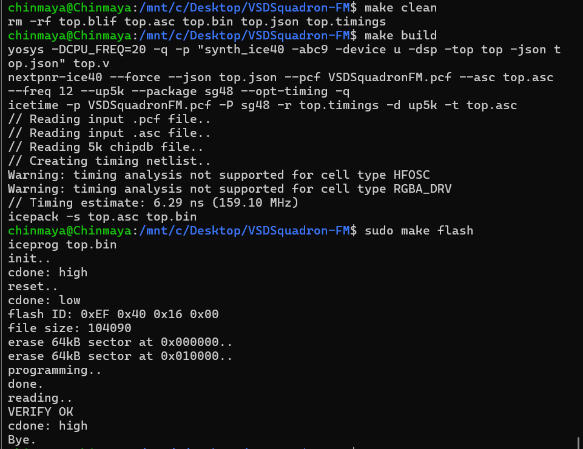
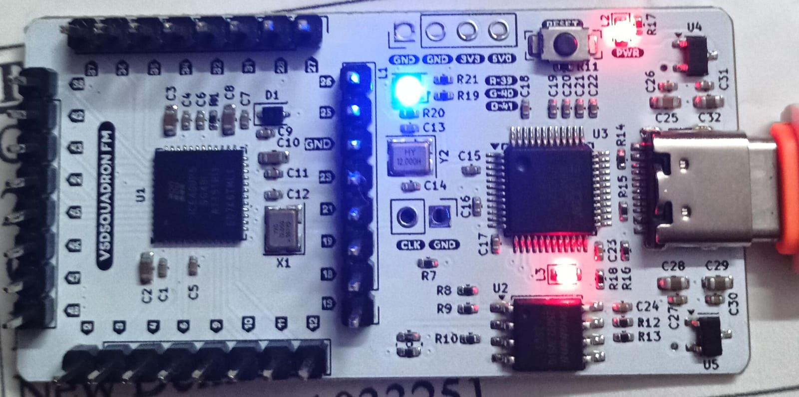

## VSDSquadron FPGA Mini Board - LED Blue Demo Documentation

This repository contains the Verilog design and pin constraint files for driving the onboard RGB LED and providing a test signal on the VSDSquadron FPGA Mini board.

---

### Step 1: Verilog Code Overview

**Module Name:** `top`

**Purpose:**

* Utilize the on‑chip high‑frequency oscillator to increment a 28‑bit counter.
* Expose a slow‑toggling `testwire` (bit 5 of the counter) for external probing.
* Drive the on‑board RGB LED with the built‑in `SB_RGBA_DRV` primitive, illuminating only the blue channel.

**Port List:**

| Port        | Direction | Description                                        |
| ----------- | --------- | -------------------------------------------------- |
| `led_red`   | output    | Red channel of the onboard RGB LED |
| `led_green` | output    | Green channel of the onboard RGB LED |
| `led_blue`  | output    | Blue channel of the onboard RGB LED |
| `hw_clk`    | input     | External oscillator input (unused in this demo)    |
| `testwire`  | output    | Debug signal: `frequency_counter_i[5]`             |

**Internal Signals & Logic:**

* **`int_osc`** (wire): Generated by the `SB_HFOSC` primitive.
* **`frequency_counter_i`** (28‑bit reg): Increments on each rising edge of `int_osc`.

```verilog
// Internal Oscillator
SB_HFOSC #(
  .CLKHF_DIV("0b10")      // Divide high-frequency clock by 4
) u_SB_HFOSC (
  .CLKHFPU(1'b1),
  .CLKHFEN(1'b1),
  .CLKHF(int_osc)
);

// Frequency Counter & Testwire
always @(posedge int_osc) begin
  frequency_counter_i <= frequency_counter_i + 1'b1;
end
assign testwire = frequency_counter_i[5];

// RGB LED Driver
SB_RGBA_DRV RGB_DRIVER (
  .RGBLEDEN(1'b1),         // Enable LED driver
  .RGB0PWM(1'b0),          // Red PWM off
  .RGB1PWM(1'b0),          // Green PWM off
  .RGB2PWM(1'b1),          // Blue PWM on (continuous)
  .CURREN(1'b1),           // Enable current
  .RGB0(led_red),
  .RGB1(led_green),
  .RGB2(led_blue)
);

defparam RGB_DRIVER.RGB0_CURRENT = "0b000001";
defparam RGB_DRIVER.RGB1_CURRENT = "0b000001";
defparam RGB_DRIVER.RGB2_CURRENT = "0b000001";
```

**Behavior Summary:**

* The internal oscillator drives a free‑running counter.
* `testwire` toggles at `osc_freq / 2^6` (visible on an LED or scope).
* Only the blue LED is driven on, as red/green PWM inputs are tied low.

---

### Step 2: Pin Constraint File (PCF)

The `VSDSquadronFM.pcf` file maps module signals to physical FPGA pins, also matching the board schematic.

```text
# VSDSquadronFM.pcf — Pin constraints for led_blue demo
set_io led_red    39
set_io led_blue   40
set_io led_green  41
set_io hw_clk     20
set_io testwire   17
```

| Signal      | FPGA Package Pin | Board Connection                    |
| ----------- | ---------------- | ----------------------------------- |
| `led_red`   | 39               | Red channel of onboard RGB LED      |
| `led_blue`  | 40               | Blue channel of onboard RGB LED     |
| `led_green` | 41               | Green channel of onboard RGB LED    |
| `hw_clk`    | 20               | Header for optional ext. oscillator |
| `testwire`  | 17               | Header pin for counter output       |

These pins are based on the board schematic and datasheet.

### Step 3: Integration with VSDSquadron FPGA Mini Board

Referred to the `VSDSquadron FPGA Mini Board Datasheet` for:

USB-C connection setup

FTDI USB drivers (for programming interface)

Installation instructions for required tools (e.g., `yosys`,`nextpnr`,`icestorm`)

**Build & Flash Instructions**

Used the provided `Makefile` to compile and flash the design:

# 1. Clean any previous builds
make clean

# 2. Synthesize and build the bitstream
make build

# 3. Flash the design onto the FPGA board (requires sudo)
sudo make flash

**Output**

The onboard blue LED lights up continuously.

The `testwire` toggles at a visible frequency and can be observed on a scope or test LED.





