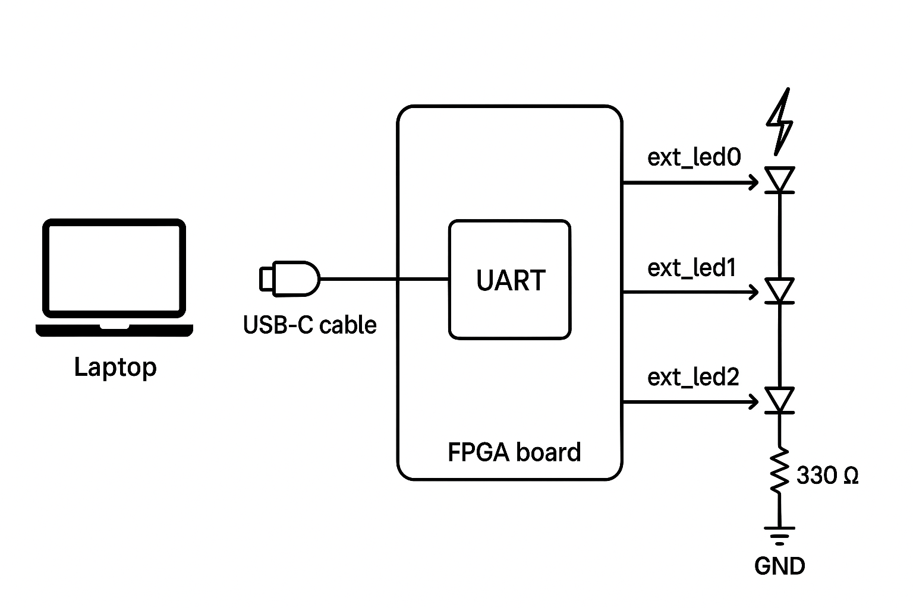
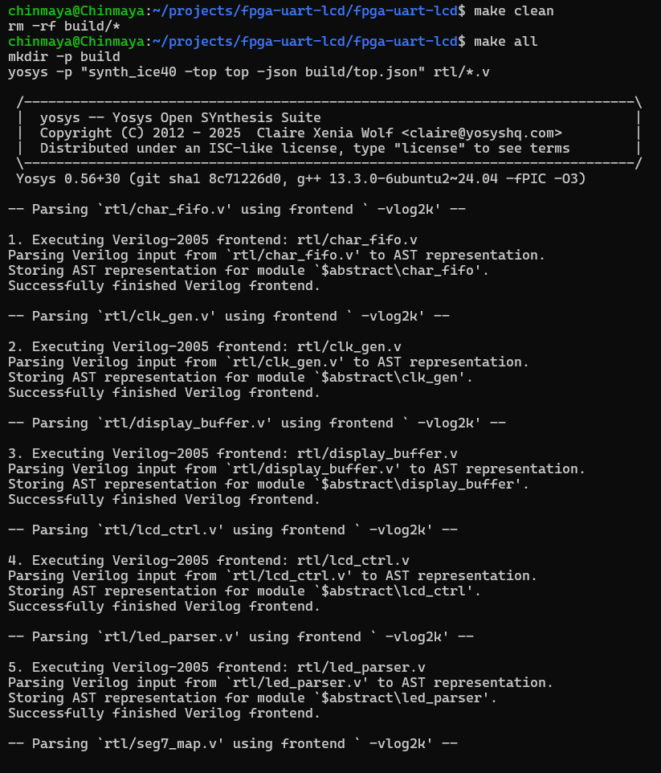
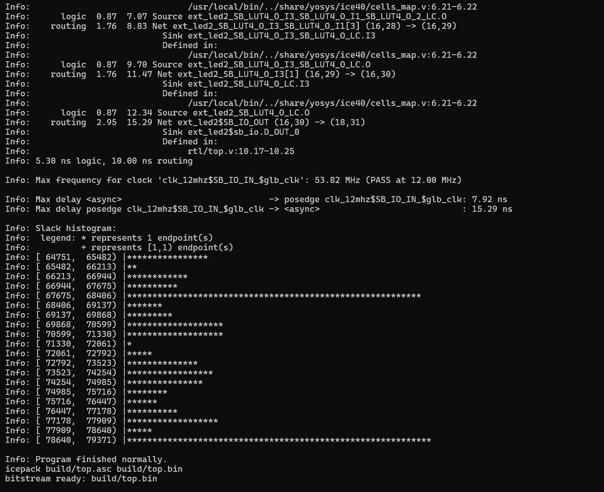
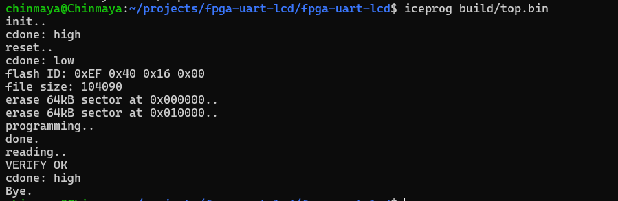
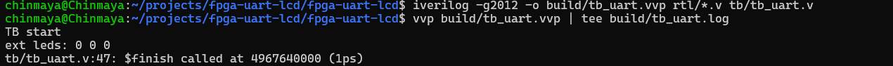

# Controlling LEDs using commands via UART - VSDSquadron FPGA Mini

## Objective

Receive single-character commands over UART (USB ↔ FTDI → FPGA) and control three external LEDs. This project demonstrates a UART receiver implemented in Verilog, a minimal parser, and safe pin mapping and wiring for external LEDs on the VSDSquadron FPGA Mini (iCE40UP5).

## Commands

- 1 — turn LED 0 ON (red)

- 2 — turn LED 1 ON (green)

- 3 — turn LED 2 ON (blue)

- 0 — turn all LEDs OFF

A short activity pulse is also shown on LED2 for any received byte to help debug reception.

---

## Repository Files

```
rtl/
  uart_rx.v         - UART receiver (8N1) module
  led_parser.v      - Simple UART command parser -> 3-bit LED output
  top.v             - Top-level module (POR, instantiate uart_rx + parser)
tb/
  tb_uart.v         - Optional simulation testbench
constraints/
  vsdsquadron.pcf   - Pin constraint file for VSDSquadron board
Makefile            - Build & flash automation (Yosys / nextpnr / icepack / iceprog)
README.md           - This document
```

---

## Code Overview

### top.v

- Implements an internal Power-On Reset (POR) (no external reset pin needed).

- Instantiates uart_rx (12 MHz → 9600 baud) and led_parser.

- Maps parser outputs to three external LED pins: ext_led0, ext_led1, ext_led2.

- ext_led2 additionally pulses when any byte is received (visual UART activity indicator).

### uart_rx.v

- Simple sampled UART receiver for 8N1 framing.

- Parameters: CLK_FREQ (12,000,000) and BAUD (9600).

- Produces dout (8-bit) and a 1-cycle valid pulse when a byte is ready.

### led_parser.v

- On rx_valid, checks rx_byte and updates leds[2:0].

- Recognizes ASCII '0','1','2','3'.

### VSDSquadronFM.pcf

- UART
   - set_io uart_rx_pin 15
   - set_io uart_tx_pin 14

- clock
   - set_io clk_12mhz 20

- external LEDs (3 pins) -> resistor -> LED -> GND
   - set_io ext_led0 25
   - set_io ext_led1 26
   - set_io ext_led2 27

---

## Pin Mapping

| Signal       | Pin | Description                           | 
| ------------ | --- | ------------------------------------- |
| `uart_tx_pin`| 14  | (unused) FPGA TX (pulled high)        |
| `clk_12mhz`  | 20  | Board 12 MHz oscillator input         |
| `uart_rx_pin`| 15  | FTDI TX → FPGA RX (data into FPGA)    |
| `ext_led0`   | 25  | External LED 0 (command '1')          |
| `ext_led1`   | 26  | External LED 1 (command '2')          |
| `ext_led2`   | 27  | External LED 2 (command '3/activity') |


---

## Hardware wiring

For each external LED:

```
FPGA pin (ext_ledX) ---> series resistor (330 Ω) ---> LED anode (+)
LED cathode (-) ---> GND (FPGA board GND)
```


---

## Build & Flash

### Prerequisites

- Yosys, nextpnr-ice40, icepack (icestorm tools), iceprog (or openFPGALoader).

- make configured as in the provided Makefile.

### Commands

```
# create build dir and compile/place&route/pack
make clean
make all

# program the FPGA (requires sudo)
sudo iceprog build/top.bin
```




---

## Using PuTTY (Windows)

- Open PuTTY → Serial.

- Select the FTDI COM port (check Device Manager; e.g., COM4).

- Baud: 9600, Data bits: 8, Parity: None, Stop bits: 1, Flow control: None.

- Click Open and type:

   - 1 → LED0 ON (red)

   - 2 → LED1 ON (green)

   - 3 → LED2 ON (blue)

   - 0 → all OFF

- No Enter required; parser reacts to the single character.

---

## Simulation

Optional quick simulation with Icarus Verilog (verify parser flow):
```
iverilog -g2012 -o build/tb_uart.vvp rtl/*.v tb/tb_uart.v
vvp build/tb_uart.vvp | tee build/tb_uart.log
```
The TB sends characters and prints ext LED states at the end.



---

## Results

- Flashing: iceprog build/top.bin → VERIFY OK

IMAGE

- Verification: PuTTY (COMx, 9600 8N1)

   - Typing 1 lights the red external LED (pin 25).

   - Typing 2 lights the green external LED (pin 26).

   - Typing 3 lights the blue external LED (pin 27).

   - Typing 0 turns all LEDs off.

- ext_led2 pulses on any received byte — visual confirmation of UART reception.

---

## Makefile targets

- make all — synthesize (Yosys), P&R (nextpnr), pack (icepack) → build/top.bin

- make flash — flash build/top.bin to board (if iceprog or openFPGALoader is configured in Makefile)

- make clean — remove build/ output

---

## Conclusion

- The FPGA reliably receives UART bytes at 9600 baud and correctly decodes single-character commands to control three external LEDs in real time.

- The UART receiver, parser, and POR logic operate as designed, providing a simple, robust serial-driven LED interface.

---

### UART Transmission Demo Video

[YouTube Short – controlling LEDs using commands received on the VSDSquadron FPGA Mini via UART](https://youtube.com/shorts/u2ZnJNXo_8g?si=fnzwOK6UrvkQFQKA)
