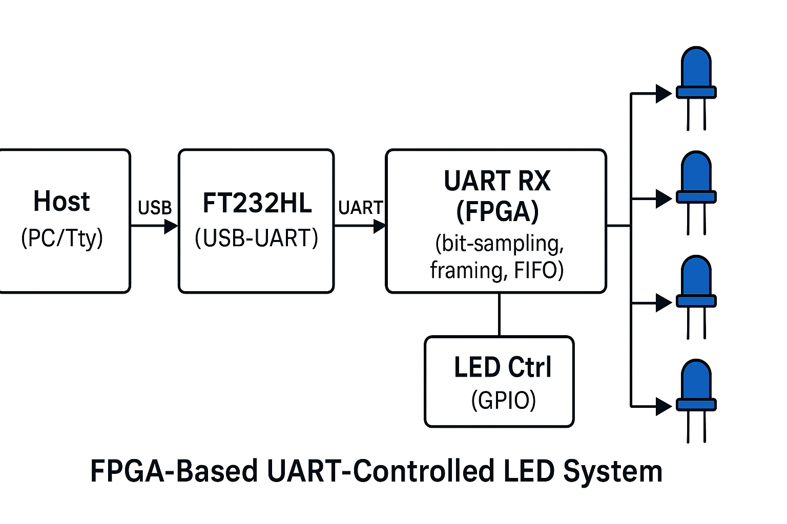

# FPGA-Based UART-Controlled LED System — Project Proposal

**Target board:** VSDSquadron FPGA Mini (iCE40UP5) with FTDI FT232HL USB-UART.
**Output:** Yellow-green LCD module (assumed HD44780-compatible 16x2/20x4 character module unless you confirm otherwise).

---

## 1. Abstract

Build an FPGA system that receives serial commands over UART (from a PC via the on-board FTDI bridge) and drives external LEDs in near real-time. The project covers UART reception implemented in Verilog, buffering and synchronization between UART input and FPGA logic, and a simple command parser/LED driver that maps ASCII commands to LED states.

Learning goals: UART RX in hardware, small FIFO/handshake buffering, command parsing, FPGA I/O driving and safe hardware interfacing, and toolflow for iCE40 devices (Yosys / nextpnr / IceStorm).

---

## 2. Literature review

* **Nandland** — UART receiver tutorials and small FPGA I/O examples (good for conceptual Verilog and wiring tips).
* **FTDI application notes** — using FT232/FT232HL as USB↔UART bridges and typical voltage/handshake considerations.
* **YouTube** — walkthroughs on building UART peripherals in Verilog and using the IceStorm toolchain for iCE40 boards.
* **FPGA/embedded texts & papers** — short references on asynchronous serial communication, debouncing, and safe IO drive rules (useful for documenting choices and validating timing).

---

## 3. System requirements

### 3.1 Hardware

* **VSDSquadron FPGA Mini (iCE40UP5)** — development board to synthesize and test the design.
* **FTDI FT232HL** — on-board USB↔UART bridge used for serial comms with the PC. Ensure VCCIO = 3.3V for compatibility.
* **External LEDs (3)** — standard LEDs (any color) mounted on breadboard. Each LED anode connects to FPGA GPIO through a series resistor; cathodes tied to board GND.
* **Series resistors** — use of 330 Ω resistors.
* **USB-C cable** — laptop → FPGA for power, programming and serial terminal.
* **Wires / breadboard** — to connect FPGA pins to LEDs and GND.

### 3.2 Software / Toolchain

* **Verilog** for RTL.
* **Simulation:** Icarus Verilog + GTKWave for unit testing.
* **FPGA Toolchain (iCE40):** Yosys (synthesis), nextpnr (place & route), icetools/icepack and iceprog for bitstream and flashing.
* **Terminal:** PuTTY (Windows) for serial command input.

---

## 4. Design architecture

### 4.1 High-level block diagram

```
+----------+    USB    +-----------+   UART   +-----------------+   Parser   +----------+
|   Host   | <-------> | FT232HL   | <----->  | UART RX (FPGA)  | <------->  | LED Ctrl |
| (PC/Tty) |           | (USB-UART)|          | (bit-sampling,   |            | (GPIO)   |
+----------+           +-----------+          |  framing, FIFO)  |            +----------+
                                                      |
                                                      v
                                               External LEDs via
                                              FPGA GPIO → resistor → LED → GND

```



### 4.2 Component descriptions

* **UART RX (Verilog):** parameterized for `CLK_FREQ`(12MHz) and `BAUD_RATE`(9600). Samples RX line, detects start bit, shifts bits, and produces `dout` + `valid` pulse.

* **Character FIFO / Buffer:** a small synchronous FIFO (depth ~64) to decouple incoming bytes from parser processing.

* **Command parser / LED state machine:** receives bytes from FIFO and sets a 3-bit LED state. Recognizes ASCII `'0'`..`'3'` (or a simplified command set) and optionally supports a basic activity blink on any byte.

* **LCD driver / top:** drives external GPIO pins with the parsed states. Uses safe drive (push-pull) to source/sink through series resistors; tristate not used. Includes optional status outputs for debugging (on-board LEDs / UART TX idle).

* **Top-level glue:**  pin mapping to VSDSquadron (PCF), reset handling (POR or pushbutton), and optional LED debouncing/pulse logic.

---

## 5. Design choices and assumptions

* **Baud rate:** 9600 bps (simple and reliable). Baud generator tuned to 12 MHz board clock.
* **Command set:** single ASCII digit commands for lowest complexity and easiest terminal use (no newline required).
* **Clocking:** single synchronous clock (12 MHz) with counters for bit sampling and byte timing to avoid CDC complexity.
* **LED wiring:** FPGA pin → 330 Ω resistor → LED anode → LED cathode → GND. LEDs are active-HIGH (FPGA drives pin HIGH to light LED). If using common-anode or different wiring, the driver can be inverted.
* **Safety:** IO currents limited by resistor; ensure LED forward current < 10–15 mA.

---

## 6. Verilog module breakdown

* `top.v` — top-level pin mapping, module instantiation, POR/reset handling.
* `uart_rx.v` — UART receiver (parameterized for CLK_FREQ and BAUD).
* `led_parser.v` — parses bytes and converts to LED state bits.
* `tb_uart.v` — testbench: simulates UART input and verifies LED outputs.
* `vsdsquadron.pcf` — pin constraint file mapping FPGA pins to `uart_rx_pin`, `clk_12mhz`, and `ext_led` pins.
* `Makefile` — build / pack / flash targets (Yosys / nextpnr / icepack / iceprog).

---

## 7. Test plan and verification

* **Unit simulation:** Icarus Verilog tests of `uart_rx.v` with various jitter/noise and `led_parser.v` logic. Generate waveforms in GTKWave.
* **Integration simulation:** TB that models a stream of characters (e.g., `1 2 3 0`) and inspects the `leds` signal over time.
* **Integration simulation:**
    - Synthesize and flash bitstream.

    - Connect external LEDs (pin → 330 Ω → LED → GND).

    - Open serial terminal (9600,8N1) to board COM port and type 1, 2, 3, 0. Verify corresponding LED behavior.

    - FTDI loopback test (short TX ↔ RX pins) to validate board UART connectivity if no response.
---

## 8. Safety and hardware checks

* Limit LED current with 330 Ω resistors.
* Ensure GND of external LEDs is common with the FPGA board GND.
* Confirm the FTDI IO voltage and FPGA VCCIO are 3.3V; do not drive 5V signals into FPGA IO.
* Use a series resistor and check the LED polarity before powering.

---

## 9. Project plan & timeline

### Day 1 — Environment & UART RX (simulation)

* Install toolchain (Yosys, nextpnr, icepack, iceprog or openFPGALoader).
* Implement `uart_rx.v`, write unit tests, verify with Icarus.
* Deliverable: Verified UART RX simulation.

### Day 2 — Parser

* Implement `led_parser.v` (single-digit commands).
* Simulate parser reaction to sequences and edge cases.
* Deliverable: Parser unit tests.

### Day 3 — Top-level & LED driver

* Implement `top.v`, wire LED outputs and safe defaults, add POR/reset behavior.
* Produce `vsdsquadron.pcf` mapping chosen GPIOs.
* Deliverable: Top-level RTL and PCF.

### Day 4 — Synthesis & P&R

* Synthesize with Yosys, run nextpnr, pack with icepack.
* Deliverables: `build/top.bin` bitstream.

### Day 5 — Hardware bring-up

* Flash FPGA, wire LEDs, test serial commands via PuTTY/picocom.
* Debug any wiring or PCF pin issues.
* Deliverable: Working hardware demo.

### Day 6 — Robustness & features and finalizing deliverables

* Add simple features: command echo, LED pulse for activity, handling unknown bytes.
* Add documentation and usage instructions.
* Deliverable: Feature-complete bitstream and user guide.
* Prepare final report, repository, and demo video/photos.
* Deliverable: Project deliverables packaged for submission.

---

## 10. Deliverables

1. **Project proposal document**.
2. **System architecture diagrams**  (schematic for FPGA → resistor → LEDs → GND).
3. **RTL source files** (Verilog): `uart_rx.v`, `led_parser.v`, `top.v`, etc.
4. **Simulation testbenches** and waveforms (Icarus/GTKWave).
5. **Bitstream** for VSDSquadron (and build scripts / Makefile).
6. **User manual**: wiring, commands, usage examples, troubleshooting tips.
7. **Demo**: short video showing UART → LEDs working.

---
