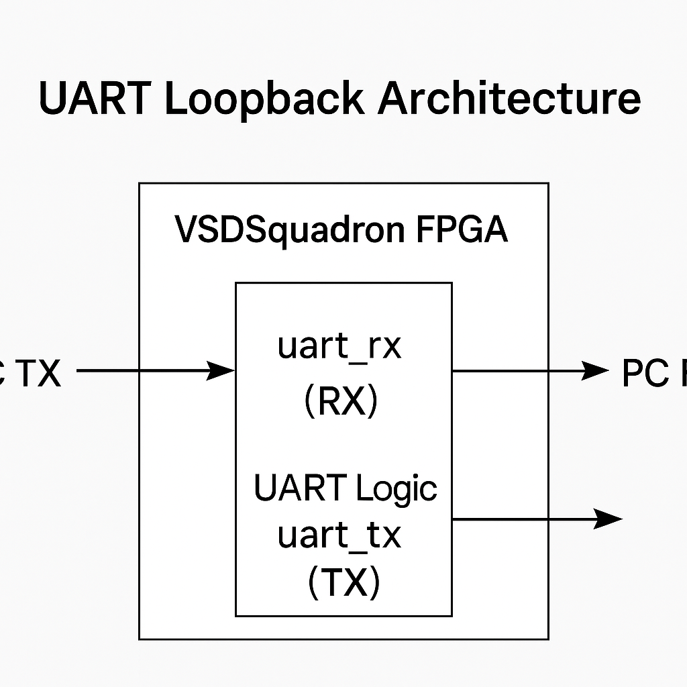

# UART Loopback - VSDSquadron FPGA Mini

## Objective

Implement a UART loopback mechanism where transmitted data is immediately received back, facilitating functional testing of the UART interface.

---

## Files

- `uart_trx.v` – Verilog source for UART loopback.
- `VSDSquadronFM.pcf` – Pin constraint file mapping UART TX/RX.
- `Makefile` – Build and flash instructions.
- `README.md` – This documentation.

---

## Step 1: Understand the Design

The `uart_trx.v` module implements:

- A UART transmitter and receiver.
- The **TX output** is looped back into the **RX input**.
- Whatever is sent to the FPGA over UART gets echoed back.

It can be visualised like this:-

     +----------------------+
TX ----> | FPGA UART | ----> RX
| (uart_trx.v logic) |
+----------------------+

**UART Loopback Architecture**


                 
- PC TX connects to uart_rx on the FPGA.

- uart_trx.v implements loopback logic inside the FPGA.

- The logic immediately sends the received byte back on uart_tx.

- PC RX receives the same data back → loopback success!


No external wiring is needed — the loopback is internal.

---

## Step 2: Pin Mapping (`uart_loopback.pcf`)

```text
set_io uart_tx 37
set_io uart_rx 36
| Signal    | Pin | Description                 |
| --------- | --- | --------------------------- |
| `uart_tx` | 37  | TX output from FPGA (to PC) |
| `uart_rx` | 36  | RX input to FPGA (from PC)  |
These match the UART header pins on the VSDSquadron FPGA Mini board.
