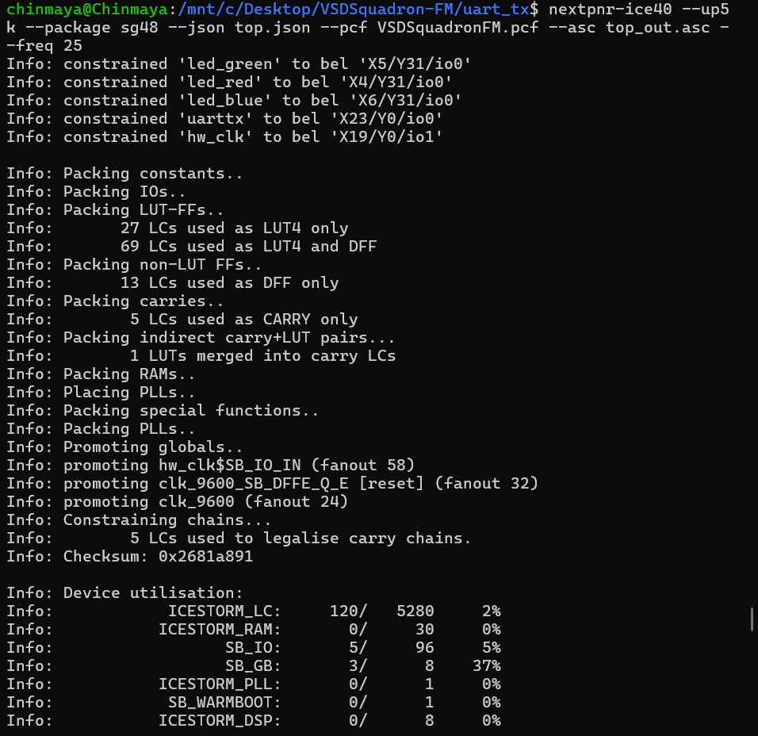

# UART Transmitter - VSDSquadron FPGA Mini

## Objective

Transmit a single character ('D') using a UART transmitter implemented on the VSDSquadron FPGA Mini board. This project demonstrates the basic principles of serial transmission using a baud-rate generator and FSM-based UART logic.

---

## Files

* `uart_trx.v` – Verilog source for UART transmission logic.
* `top.v` – Top-level Verilog module instantiating and configuring the UART transmitter.
* `VSDSquadronFM.pcf` – Pin constraint file mapping `uart_tx` and `clk` to FPGA pins.
* `Makefile` – Build and flash instructions.
* `README.md` – This documentation.

---

## Code Overview

### top.v
- Instantiates `uart_tx_8n1` to send the character "D"
- Uses SB_HFOSC for 12 MHz clock
- Divides clock to create 9600 Hz
- Uses counter to generate send trigger

### uart_trx.v
- FSM with states: IDLE, STARTTX, TXING, TXDONE
- Transmits 1 start bit, 8 data bits, 1 stop bit

### VSDSquadronFM.pcf
- Pin 14 = uarttx (TX)
- Pin 20 = hw_clk (clock input)

### Makefile
- `make build`: Synthesizes and P&R
- `make flash`: Programs the FPGA
- `make terminal`: Opens serial terminal using picocom

---

## Step 1: Understand the Design

The design transmits the character 'D' over UART at 9600 baud. The `uart_trx.v` module handles UART transmission using a simple FSM. A clock divider reduces the 12 MHz oscillator to the appropriate baud rate.

### UART Transmitter Architecture

```
+--------------------------+
|                          |
|   Clock Divider (9600)   |
|                          |
+------------+-------------+
             |
             v
+--------------------------+
|  UART FSM: Start -> TX -> Done  |
|  (start bit, 8 data bits, stop) |
+--------------------------+
             |
             v
         uart_tx (Pin 14)
```

**Diagram:**


* The oscillator is divided to 9600 baud.
* The FSM transmits: Start bit (0), bits of 'D', Stop bit (1).
* Data is sent through Pin 14 (TX).

---

## Step 2: Pin Mapping (`VSDSquadronFM.pcf`)

```text
set_io uarttx 14
set_io hw_clk 20
```

| Signal   | Pin | Description                 |
| -------- | --- | --------------------------- |
| `uarttx` | 14  | TX output from FPGA (to PC) |
| `hw_clk` | 20  | 12 MHz oscillator clock     |

These match the TX pin on the VSDSquadron FPGA Mini board.

---

## Step 3: Circuit Diagram

A simple UART TX-only setup is shown below:


* Connect Pin 14 (TX) from FPGA to RX of USB-UART converter.
* Connect GND from FPGA to GND of USB-UART converter.
* No connection needed for RX since it's a one-way transmitter.

---

## Step 4: Build & Flash

Run the following in the project directory:

```text
make clean       # Remove previous builds
make build       # Synthesizes and places design
sudo make flash  # Flash to FPGA board
```

---

## Step 5: Testing

Use a serial terminal to view output:

```text
sudo picocom -b 9600 /dev/ttyUSB0
```

Expected result: the terminal repeatedly prints the character 'D'.


---

## Testing & Verification

**Objective:**
To verify successful UART transmission of the character 'D' from the FPGA.

**Procedure:**

1. Connect FPGA TX (Pin 14) to USB UART RX.
2. Power FPGA.
3. Open serial terminal using baud 9600.
4. Observe terminal output.

**Expected Output:**

```text
DDDDDDDDDDDDDDDDDD...
```
## Findings & Test Results

1. **Synthesis**  
   - Yosys successfully generated `top.json`.  
   - 
   - 
   - 
   - 
   - 
   - 
   - 
   - 
   - 
   - 
   - 
   - 
   - 
   - 
   - 
   - 
   - 
   - 
   - 
   - 
   - 
   - 
   - 
   - 
   - 
   - 
   - 
   - 
   - 
   - 
   - 
   - 
   - 
   - 
   - 
   - 
   - 
   - 
   - 
   - 
   - 
   - 
   - 
   - 
   - 
   - 
   - 
   - 
   - 
   - 
   - 
   - 
   - 
   - 
   - 
   - 
   - 

2. **Place & Route**  
   - nextpnr-ice40 placed and routed with 0% utilization of critical primitives.    

3. **Bitstream Generation**  
   - `icepack` created `top_out.bin` without errors.  

4. **Programming the FPGA**  
   - `iceprog` successfully flashed the board (VERIFY OK).  
   -   

5. **UART Verification**  
   - PuTTY on Windows (COM5, 9600 baud, 8N1) showed continuous ‘D’.  
   - 

   - picocom on Linux (`sudo picocom -b 9600 /dev/ttyUSB0`) confirmed the same.    

**Conclusion:**
The FPGA successfully transmits the UART data repeatedly. The FSM and divider logic operate correctly to output the 'D' character at 9600 baud.

### UART Transmission Demo Video

[YouTube Short – UART TX Demo](https://youtube.com/shorts/VtstkPyz7ns?si=Y0yuQZwfJEE9kOj5)
