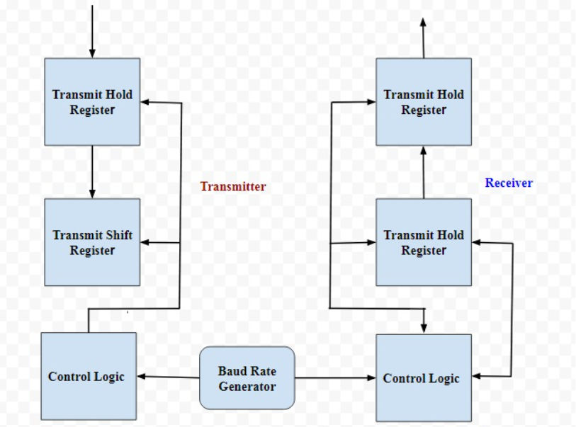
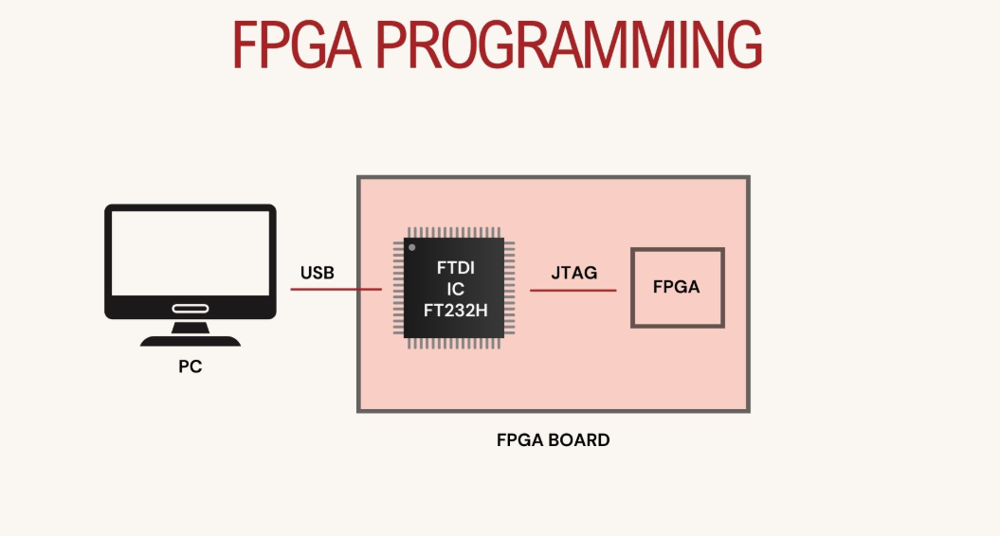
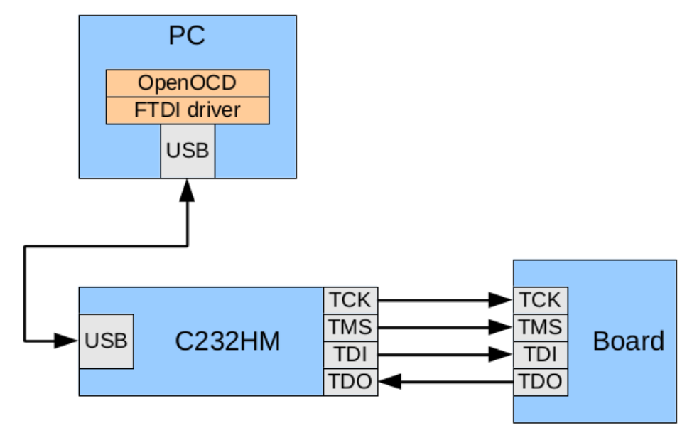
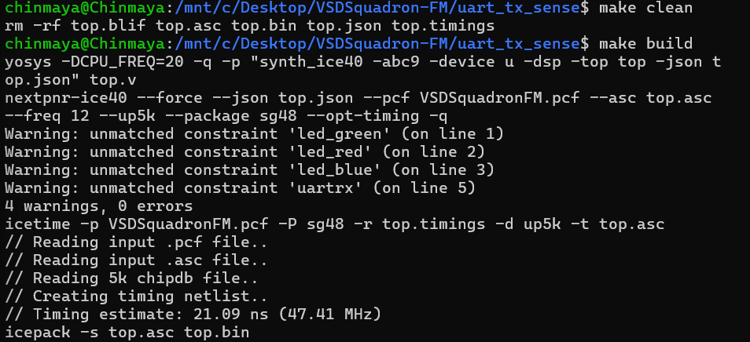

# UART Sensor Data Transmitter – VSDSquadron FPGA Mini

## Objective

Implement a UART transmitter on the VSDSquadron FPGA Mini that sends real-time sensor readings from an IR sensor module to an external device. The project demonstrates integrating a sensor interface with UART transmission logic for live monitoring.

---

## Files

* `uart_tx_sense.v` – Verilog source for UART transmission logic with sensor input.

* `sensor_if.v` – Verilog module to acquire data from the IR sensor.

* `top.v` – Top-level Verilog module integrating sensor interface and UART transmitter.

* `VSDSquadronFM.pcf` – Pin constraint file mapping UART, sensor, and clock signals to FPGA pins.

* `Makefile` – Build and flash instructions.

* `README.md` – This documentation.

---

## Code Overview

### top.v

- Instantiates sensor_if to read the IR sensor’s output.

- Instantiates uart_tx_8n1 to send the sensor reading in ASCII format.

- Uses SB_HFOSC for 12 MHz system clock.

- Clock divider generates the required baud rate (9600).

- Transmits sensor status periodically.

### sensor_if.v

- Reads the digital output pin from the IR sensor module.

- Converts high/low sensor state into ASCII ("1" for detection, "0" for no detection).

- Provides data to UART transmitter.

### uart_tx_sense.v

- FSM with states: IDLE, STARTTX, TXING, TXDONE.

- Transmits:

    - 1 start bit

    - 8 data bits (sensor ASCII code)

    - 1 stop bit

## Step 1: System Architecture

### Block Diagram

```
     +-----------------+       +------------------+       +-------------+
     |   IR Sensor IF   | --->  | UART TX (FSM)    | --->  | uart_tx Pin |
     +-----------------+       +------------------+       +-------------+
                ^                           ^
                |                           |
        IR Sensor Module              Clock Divider (9600 baud)
```


- The IR sensor output is read by the FPGA.

- The data is encoded as ASCII "0" or "1".

- UART transmitter sends it to an external receiver (PC/MCU) at 9600 baud.

## Step 2: Pin Mapping (VSDSquadronFM.pcf)

```
set_io uarttx 14
set_io hw_clk 20
set_io ir_sensor 25
```
| Signal      | Pin | Description                          | 
| ----------- | --- | ------------------------------------ |
| `uarttx`    | 14  | TX output from FPGA (to PC)          |
| `hw_clk`    | 20  | 12 MHz oscillator clock              |
| `ir_sensor` | 25  | Digital output from IR sensor module |

## Step 3: Circuit Diagram





- IR Sensor Module VCC → FPGA 3.3V

- IR Sensor GND → FPGA GND

- IR Sensor OUT → FPGA Pin 25

- FPGA Pin 14 (TX) → USB-UART RX

- GND (FPGA) → GND (USB-UART)

## Step 4: Build & Flash

```
make clean       # Remove previous builds
make build       # Synthesize & place/route design
sudo make flash  # Flash to FPGA
```


## Step 5: Testing

1. Power the FPGA board and connect USB-UART to PC.

2. Open a serial terminal at 9600 baud, 8N1:

```
sudo picocom -b 9600 /dev/ttyUSB0
```

3. Move an object in front of the IR sensor.

4. Observe "1" (object detected) or "0" (no detection) appearing in the terminal.

## Testing & Verification

**Objective:**

Verify that real-time IR sensor readings are transmitted over UART.

**Procedure:**

1. IR sensor output connected to FPGA.

2. FPGA sends ASCII "0" or "1" depending on sensor state.

3. Serial terminal displays the readings.

**Output:**

```
000000011111111000001...
```

## Findings & Test Results

1. Synthesis – Completed with no errors.

2. Place & Route – No routing issues, minimal resource usage.

3. Bitstream Generation – icepack created top_out.bin successfully.

4. Programming – iceprog flashed the FPGA with verify OK.

5. UART Verification –

    - "1" appears when object is detected by IR sensor.

    - "0" appears otherwise.

    - Verified in PuTTY (Windows) and picocom (Linux).